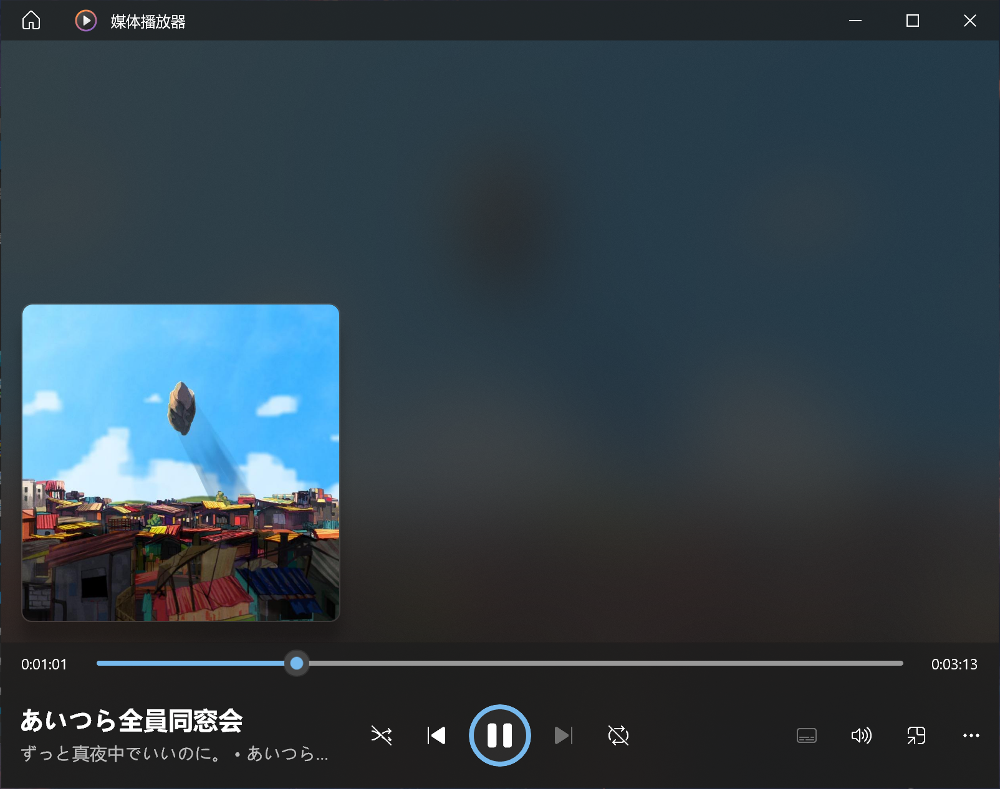
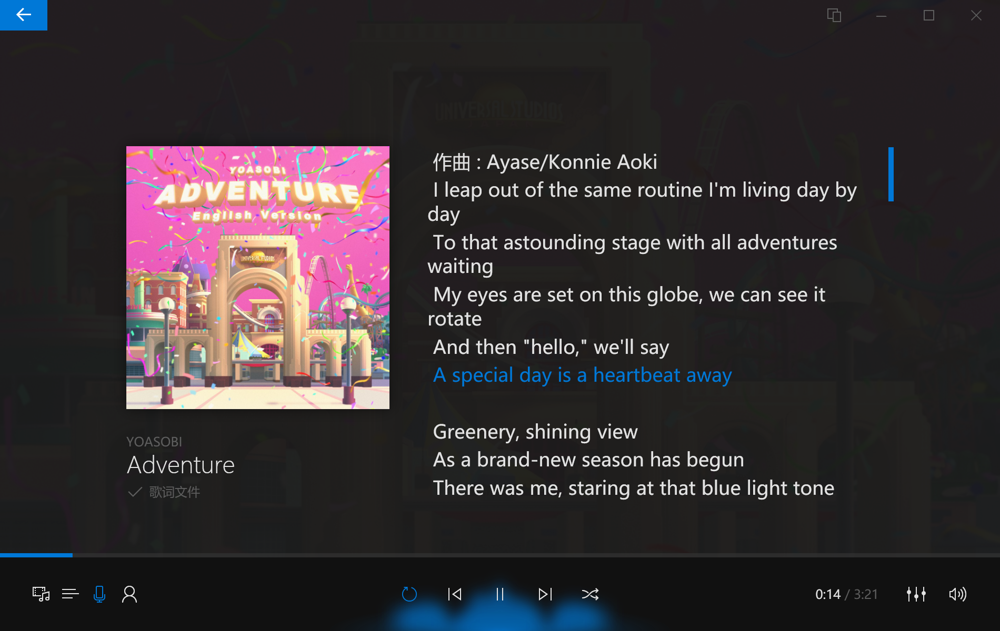

# NCM-Downloader
A powerful NCM Downloader that supports built-in metadata (title, artists, album, cover)

一个强大的网易云下载工具，支持内嵌元信息（歌曲名，歌手，专辑，歌曲封面），暂时只支持下载歌单

[官网](https://ncm.xuxiny.tophttps://ncm.xuxiny.top)

## 📷 ScreenShots


新版样式（v1.5.0及以上）：




v1.1.0及以上支持下载歌词，使用支持读取歌词文件的播放器打开即可（图为Dopamine）：




v1.5.0及以上支持同时获取原始歌词和翻译歌词，并且支持内嵌歌词和歌词文件两种模式


## 🔨 Usage
Clone this project

```
git clone https://github.com/xxynet/NCM-Downloader.git
```

Install requirements

```
pip install -r requirements.txt
```

Edit `config.ini`

```
[output]

#设置歌单输出路径，如果为空则默认为程序所在目录（路径无需引号包裹）
path = 

#0->歌名-歌手 1->歌手-歌名 2->歌名（暂时无效）
filename = 0

#是否下载歌词 1 -> 下载LRC歌词文件  2 -> 内嵌歌词  0 -> False
lrc = 0
```

Copy your cookie into `cookie.txt`

Run `main.py` and input your playlist ID


For executable files, please access to [Releases](https://github.com/xxynet/NCM-Downloader/releases)

## 💬 Q&A

<details>

<summary>Q: 为什么要配置Cookie，如何配置Cookie？</summary>

> A: 由于网易云API调整，未登录用户只能获取歌单前10首歌曲，配置Cookie后可以获取完整歌单信息。
> 
> 首先访问[网易云官网](https://music.163.com/)，按键盘上的F12，打开DevTools，切换到Network（网络）选项卡，按键盘上的Ctrl+R刷新，随便点一个项目（如music.163.com），在Headers（标头）中下拉，找到Request Headers（请求标头）中的Cookie，复制右侧的值，填入配置文件即可。

</details>

<details>

<summary>Q: 提示“获取歌曲信息异常，请重新运行本程序”</summary>

> A: 网易云服务器繁忙，可以再试几次，若仍然无法下载，请等待一会儿再试

</details>

<details>

<summary>Q: 如何获取歌单ID？</summary>

> A: 使用网页版打开想要下载的歌单（必须是公开的歌单），复制链接中```?id=```后面的数字
>
> ```
> https://music.163.com/#/playlist?id=歌单ID
> ```

</details>

<details>

<summary>Q: 运行后提示“Windows 已保护你的电脑”？</summary>

> A: 本程序使用pyinstaller打包，请点击“更多信息” -> “仍要运行”

</details>

## 🌟 Star History

[](https://star-history.com/#xxynet/NCM-Downloader&Date)